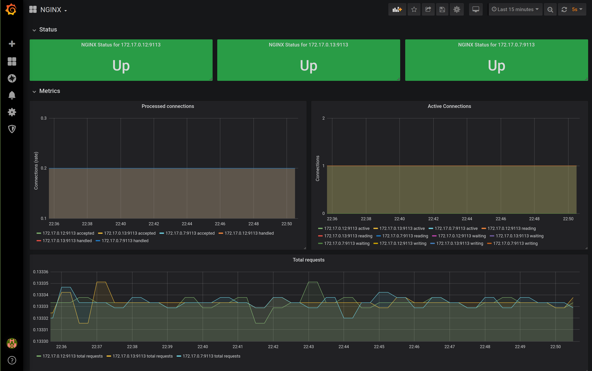

<!-- EX должны нумероваться так, как они идут в ЛК otus -->

# EX-10 Мониторинг компонентов кластера и приложений работающих в нем

* [EX-10 Мониторинг компонентов кластера и приложений работающих в нем](#ex-10-%d0%9c%d0%be%d0%bd%d0%b8%d1%82%d0%be%d1%80%d0%b8%d0%bd%d0%b3-%d0%ba%d0%be%d0%bc%d0%bf%d0%be%d0%bd%d0%b5%d0%bd%d1%82%d0%be%d0%b2-%d0%ba%d0%bb%d0%b0%d1%81%d1%82%d0%b5%d1%80%d0%b0-%d0%b8-%d0%bf%d1%80%d0%b8%d0%bb%d0%be%d0%b6%d0%b5%d0%bd%d0%b8%d0%b9-%d1%80%d0%b0%d0%b1%d0%be%d1%82%d0%b0%d1%8e%d1%89%d0%b8%d1%85-%d0%b2-%d0%bd%d0%b5%d0%bc)
  * [EX-10.1 Что было сделано](#ex-101-%d0%a7%d1%82%d0%be-%d0%b1%d1%8b%d0%bb%d0%be-%d1%81%d0%b4%d0%b5%d0%bb%d0%b0%d0%bd%d0%be)
  * [EX-10.2 Как запустить проект](#ex-102-%d0%9a%d0%b0%d0%ba-%d0%b7%d0%b0%d0%bf%d1%83%d1%81%d1%82%d0%b8%d1%82%d1%8c-%d0%bf%d1%80%d0%be%d0%b5%d0%ba%d1%82)
  * [EX-10.3 Как проверить проект](#ex-103-%d0%9a%d0%b0%d0%ba-%d0%bf%d1%80%d0%be%d0%b2%d0%b5%d1%80%d0%b8%d1%82%d1%8c-%d0%bf%d1%80%d0%be%d0%b5%d0%ba%d1%82)
  * [EX-10.4 Как начать пользоваться проектом](#ex-104-%d0%9a%d0%b0%d0%ba-%d0%bd%d0%b0%d1%87%d0%b0%d1%82%d1%8c-%d0%bf%d0%be%d0%bb%d1%8c%d0%b7%d0%be%d0%b2%d0%b0%d1%82%d1%8c%d1%81%d1%8f-%d0%bf%d1%80%d0%be%d0%b5%d0%ba%d1%82%d0%be%d0%bc)

## EX-10.1 Что было сделано

* Основное задание: создать deployment с образом nginx, который умеет отдавать метрики через `stub_status` и sidecar-контейнером nginx prometheus exporter
* Основное задание: создать service для доступа к deployment
* Основное задание: развернуть prometheus operator (использован helm3)
* Основное задание: добавить в grafana графики для nginx prometheus exporter

## EX-10.2 Как запустить проект

* Собрать и запушить docker image с включенным локейшеном с мониторингом:

  ```bash
  cd kubernetes-monitoring/docker/
  docker build -t loktionovam/web:1.17.1-alpine-2 .
  docker push loktionovam/web:1.17.1-alpine-2
  ```

* Создать deployment и service для nginx, при этом service будет типа ClusterIP, а метрики sidecar контейнер будет отдавать по адресу `http://nginx-svc:9113/metrics`

  ```bash
  cd kubernetes-monitoring
  kubectl apply -f nginx-deployment.yaml --validate=true
  kubectl apply -f nginx-svc.yaml --validate=true
  ```

* Установить prometheus-operator

  ```bash
  kubectl apply -f monitoring-ns.yaml
  helm upgrade --install prometheus-operator stable/prometheus-operator --namespace=monitoring --values=values.yaml
  ```

* Добавить дашборд для nginx в grafana (в `grafana-nginx-dashboard.yaml` используется метка `grafana_dashboard: "1"`, по которой sidecar контейнер `grafana-sc-dashboard` автоматически добавляет дашборды из configmap в grafana)

  ```bash
  kubectl apply -f grafana-nginx-dashboard.yaml
  ```

## EX-10.3 Как проверить проект

* Пробросить порт grafana на локальный компьютер

  ```bash
  kubectl port-forward svc/prometheus-operator-grafana 3000:80 -n monitoring
  ```

* Войти в веб-интерфейсе grafana <http://localhost:3000>, найти дашборд для nginx exporter и убедиться, что метрики собираются с трех контейнеров:

  

## EX-10.4 Как начать пользоваться проектом
