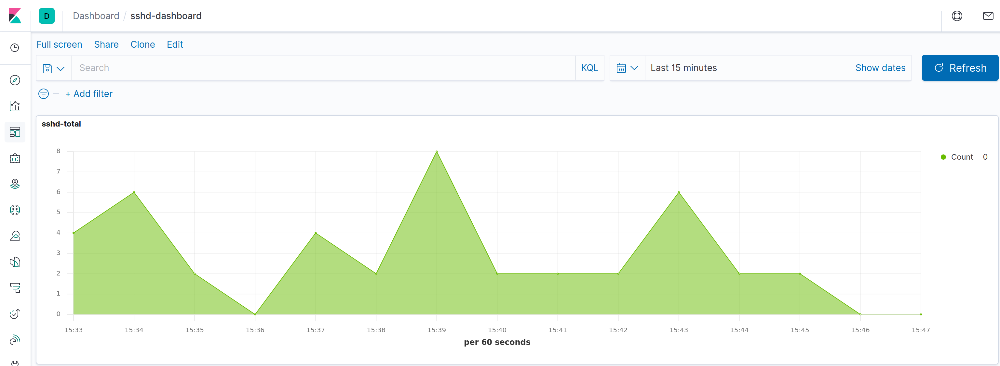
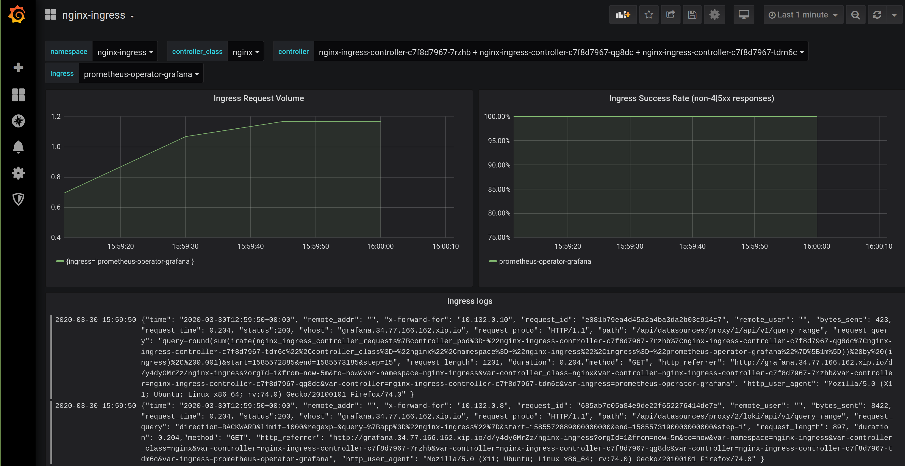

<!-- EX должны нумероваться так, как они идут в ЛК otus -->

# EX-11 Название домашней работы

* [EX-11 Название домашней работы](#ex-11-%d0%9d%d0%b0%d0%b7%d0%b2%d0%b0%d0%bd%d0%b8%d0%b5-%d0%b4%d0%be%d0%bc%d0%b0%d1%88%d0%bd%d0%b5%d0%b9-%d1%80%d0%b0%d0%b1%d0%be%d1%82%d1%8b)
  * [EX-11.1 Что было сделано](#ex-111-%d0%a7%d1%82%d0%be-%d0%b1%d1%8b%d0%bb%d0%be-%d1%81%d0%b4%d0%b5%d0%bb%d0%b0%d0%bd%d0%be)
  * [EX-11.2 Как запустить проект](#ex-112-%d0%9a%d0%b0%d0%ba-%d0%b7%d0%b0%d0%bf%d1%83%d1%81%d1%82%d0%b8%d1%82%d1%8c-%d0%bf%d1%80%d0%be%d0%b5%d0%ba%d1%82)
  * [EX-11.3 Как проверить проект](#ex-113-%d0%9a%d0%b0%d0%ba-%d0%bf%d1%80%d0%be%d0%b2%d0%b5%d1%80%d0%b8%d1%82%d1%8c-%d0%bf%d1%80%d0%be%d0%b5%d0%ba%d1%82)
  * [EX-11.4 Как начать пользоваться проектом](#ex-114-%d0%9a%d0%b0%d0%ba-%d0%bd%d0%b0%d1%87%d0%b0%d1%82%d1%8c-%d0%bf%d0%be%d0%bb%d1%8c%d0%b7%d0%be%d0%b2%d0%b0%d1%82%d1%8c%d1%81%d1%8f-%d0%bf%d1%80%d0%be%d0%b5%d0%ba%d1%82%d0%be%d0%bc)

## EX-11.1 Что было сделано

* [x] Основное задание: развернут infra pool (3 nodes), default pool (1 node) в GKE, исправлена конфигурация terraform
* [x] Основное задание: установлен EFK для сбора и визуализации логов
* [x] Основное задание: установлен prometheus operator (promethues, grafana, alertmanager) для мониторинга elasticsearch
* [x] Основное задание: установлен elasticsearch exporter, настроен алерт `ElasticsearchTooFewNodesRunning`, в grafana добавлен дашборд для визуализации метрик elasticsearch
* [x] Основное задание: сбор и визуализация логов nginx (nginx-total, nginx-2xx, nginx-3xx, nginx-4xx, nginx-5xx), дашборд для логов nginx в kibana
* [x] Основное задание: сбор и визуализация логов nginx с помощью loki, визуализации логов в grafana
* [x] Задание со (*): сбор логов виртуальных машин на которых запущен k8s через `systemd input plugin` и визуализация логов для `sshd`

## EX-11.2 Как запустить проект

* Развернуть infra pool и default pool в GKE

  ```bash
  cd infra/kubernetes/terraform
  terraform init
  terraform import google_storage_bucket.storage-bucket kubernetes-tf-state-bucket-20190202001
  terraform apply
  cd gke
  terraform apply
  ```

* Настроить kubectl для доступа к кластеру

  ```bash
  gcloud beta container clusters get-credentials primary --zone europe-west1-b
  ```

* Настроить taints для infra нод кластера

  ```bash
  kubectl get nodes
  kubectl taint nodes <infra node here> node-role=infra:NoSchedule
  ```

* Установить helm charts

  ```yaml
  cd kubernetes-logging/
  helm upgrade --install elasticsearch elastic/elasticsearch --wait --namespace observability -f elasticsearch.values.yaml
  helm upgrade --install nginx-ingress stable/nginx-ingress --wait --namespace=nginx-ingress -f nginx-ingress.values.yaml
  helm upgrade --install kibana elastic/kibana --wait --namespace observability -f kibana.values.yaml
  helm upgrade --install fluent-bit stable/fluent-bit --wait --namespace observability -n observability -f fluent-bit.values.yaml
  helm upgrade --install prometheus-operator stable/prometheus-operator --namespace=observability --values=prometheus.values.yaml
  helm upgrade --install elasticsearch-exporter stable/elasticsearch-exporter --wait --namespace=observability --values=elasticsearch-exporter.values.yaml

  kubectl get secrets -n observability prometheus-operator-grafana  -o jsonpath="{.data.admin-password}" | base64 -d

  helm repo add loki https://grafana.github.io/loki/charts
  helm repo update
  helm upgrade --install loki loki/loki-stack --wait --namespace=observability --values=loki.values.yaml
  ```

Есть проблема [Add datasource by configuration to Grafana does not work](https://github.com/coreos/prometheus-operator/issues/1909) из-за чего `datasource` не обновляются sidecar контейнером grafana-sc-datasources. Простейшее решение - удалить pod grafana, тогда после его автоматического пересоздания, sidecar контейнер отработает и loki добавится в список datasource:

```bash
kubectl delete pods prometheus-operator-grafana-7454c9d578-prqzk
```

## EX-11.3 Как проверить проект

* В kibana <http://kibana.34.77.166.162.xip.io> есть дашборды для отображения запросов в nginx ingress и sshd
  
* В grafana по адресу <http://grafana.34.77.166.162.xip.io> отображаются логи и метрики для nginx ingress controller
  

## EX-11.4 Как начать пользоваться проектом
